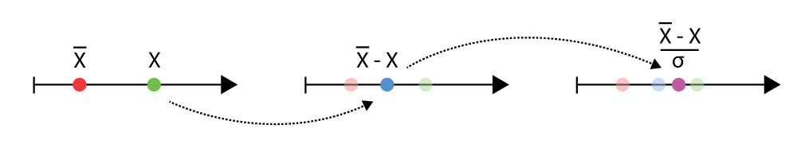

# Der z-Test

```{r}
#| echo: false
#| warning: false
#| message: false
source('_common.R')

library(tidyverse)
```

Einer der am einfachsten nachzuvollziehenden statistischen Tests ist der z-Test der auch als Einstichprobentest bezeichnet wird. Der z-Test beruht auf einem Vergleich des beobachteten Werts mit der Standardnormalverteilung $\Phi(z)$, also der Normalverteilung mit Mittelwert $\mu=0$ und Standardabweichung $\sigma=1$. Um die Idee des z-Tests nachzuvollziehen muss zunächst das Konzept eines **z-Werts** eingeführt werden.

## Der z-Wert

Wie bereits besprochen, kann die Form der Normalverteilung mittels des Mittelwerts $\mu$ und der Standardabweichung $\sigma$ verändert werden. Die mathematische Form der Normalverteilung ist wie folgt:

$$
f(x|\mu,\sigma^2) = \frac{1}{\sqrt{2 \pi \sigma^2}}e^{\left(-\frac{(x-\mu)^2}{2\sigma^2}\right)} 
$$ {#eq-ztest-normal-dist}

Wenn nun Werte für $x$ und gegebene $\mu$ und $\sigma$ berechnet werden, dann ergibt sich die bekannte Glockenform (siehe @fig-ztest-normdist-01).

```{r}
#| fig-cap: "Dichtefunktion der Normalverteilung für gegebene $\\mu$ und $\\sigma$."
#| label: fig-ztest-normdist-01

tibble(x=seq(-3,3,length=100), p=dnorm(x))  |> 
ggplot(aes(x,p)) +
  geom_ribbon(aes(ymin = 0, ymax = p), fill = 'red', alpha=.3) +
  geom_line(size=2, col='red') + 
  scale_x_continuous("x-Wert", breaks=NULL) +
  scale_y_continuous("Dichte", breaks=NULL)
```

Die Verteilung kann nun anhand der Standardabweichung $\sigma$ in verschiedene Bereiche eingeteilt werden in denen Werte mit unterschiedlichen Wahrscheinlichkeiten auftreten. So können die Bereiche $[\mu-\sigma,\mu+\sigma]$, $[\mu-2\cdot\sigma,\mu+2\cdot\sigma]$ und $[\mu-3\cdot\sigma,\mu+3\cdot\sigma]$ beispielsweise unterschieden werden. D.h. es wird jeweils ausgehend vom Mittelwert $\mu$ ein Bereich oberhalb und unterhalb mittels Multiplikation mit der Standardabweichung $\sigma$ ausgezeichnet (siehe @fig-ztest-dnorm-02).

```{r}
#| fig-cap: "Dichtefunktion von $\\mathcal{N}(\\mu,\\sigma^2)$"
#| label: fig-ztest-dnorm-02

x <- seq(-4, 4, 0.01)
sigma <- 1.3
mu <- 0
p <- dnorm(x, mean = mu, sd = sigma)
df <- data.frame(x, p) 
lab_dat <- tibble(x = c(-3,-2,-1,1,2,3)*sigma, p = 0.05, 
                  labels = c(bquote(-3~sigma),bquote(-2~sigma), bquote(-sigma),
                             'sigma',bquote(2~sigma),bquote(3~sigma)))
ggplot(df, aes(x,p, ymin = 0, ymax = p)) +
#  geom_ribbon(aes(ymin = 0, ymax = p), fill = 'red', alpha=.3) +
  geom_ribbon(data = tibble(x = seq(-1*sigma,1*sigma,0.01), p = dnorm(x, mu, sigma)), fill = 'green', alpha = .3) +
  geom_ribbon(data = tibble(x = seq(-2*sigma,-1*sigma,0.01), p = dnorm(x, mu, sigma)), fill = 'magenta', alpha = .3) +
  geom_ribbon(data = tibble(x = seq(1*sigma,2*sigma,0.01), p = dnorm(x, mu, sigma)), fill = 'magenta', alpha = .3) +
  geom_ribbon(data = tibble(x = seq(2*sigma,3*sigma,0.01), p = dnorm(x, mu, sigma)), fill = 'blue', alpha = .3) +
  geom_ribbon(data = tibble(x = seq(-3*sigma,-2*sigma,0.01), p = dnorm(x, mu, sigma)), fill = 'blue', alpha = .3) +
  geom_line() + 
  geom_label(data = lab_dat, aes(x = x, label = labels), parse = T) +
  scale_x_continuous(breaks=0, labels = expression(mu)) +
  labs(x = 'Werte', y = 'Dichte') 
```

Da diese Bereiche unterschiedliche Flächen auszeichnen, haben diese Bereiche jeweils ein bestimmte Wahrscheinlichkeit (siehe @tbl-ztest-dnorm) und es ergibt sich die folgende Tabelle.

| Bereich | Wahrscheinlichkeit |
| --- | --- |
| $[\mu-\sigma,\mu+\sigma]$ | $\approx 68\%$ |
| $[\mu-2\cdot\sigma,\mu+2\cdot\sigma]$| $\approx 95\%$ |
| $[\mu-3\cdot\sigma,\mu+3\cdot\sigma]$ | $\approx 99\%$ |

: Bereiche der Normalverteilung {#tbl-ztest-dnorm}

D.h., wenn eine Statistik einer Normalverteilung folgt, dann ist die Wahrscheinlichkeit, dass der Wert innerhalb des Bereiches $\pm \sigma$ um den Mittelwert $\mu$ herum fällt etwa $68\%$. Die Wahrscheinlickeiten sind nicht exakt, aber können in vielen Fällen als einfache *Daumenregeln* verwendet werden.

Nun ist es manchmal etwas müßig die Bereiche immer auszurechnen und es wäre einfacher wenn eine Normalverteilung verwendet würde bei der die Bereiche *direkt* ablesbar sind. Diejenige Normalverteilung die dies erfüllt ist die Standardnormalverteilung.

::: {#def-standard-normal}
## Standardnormalverteilung $\Phi(z)$

Die Standardnormalverteilung ist die Normalverteilung mit Mittelwert $\mu=0$ und Standardabweichung $\sigma=1$.
:::

Die Standardnormalverteilung hat auch eine zentrale Rolle in der theoretischen Statistik, so dass sie ein eigenes Symbol $\Phi$ spendiert bekommen hat. In @fig-ztest-stdnorm-01 ist die Dichtekurve der Standardnormalverteilung abgetragen.

```{r}
#| fig-cap: "Dichtefunktion der Standardnormalverteilung $\\Phi(x)$ mit $\\mu=0$ und $\\sigma^2=1$"
#| label: fig-ztest-stdnorm-01

x <- seq(-3, 3, 0.01)
sigma <- 1
mu <- 0
p <- dnorm(x, mean = mu, sd = sigma)
df <- data.frame(x, p) 
lab_dat <- tibble(x = c(-3,-2,-1,1,2,3)*sigma, p = 0.05, 
                  labels = c(bquote(-3~sigma),bquote(-2~sigma), bquote(-sigma),
                             'sigma',bquote(2~sigma),bquote(3~sigma)))
ggplot(df, aes(x,p, ymin = 0, ymax = p)) +
#  geom_ribbon(aes(ymin = 0, ymax = p), fill = 'red', alpha=.3) +
  geom_ribbon(data = tibble(x = seq(-1*sigma,1*sigma,0.01), p = dnorm(x, mu, sigma)), fill = 'green', alpha = .3) +
  geom_ribbon(data = tibble(x = seq(-2*sigma,-1*sigma,0.01), p = dnorm(x, mu, sigma)), fill = 'magenta', alpha = .3) +
  geom_ribbon(data = tibble(x = seq(1*sigma,2*sigma,0.01), p = dnorm(x, mu, sigma)), fill = 'magenta', alpha = .3) +
  geom_ribbon(data = tibble(x = seq(2*sigma,3*sigma,0.01), p = dnorm(x, mu, sigma)), fill = 'blue', alpha = .3) +
  geom_ribbon(data = tibble(x = seq(-3*sigma,-2*sigma,0.01), p = dnorm(x, mu, sigma)), fill = 'blue', alpha = .3) +
  geom_line(size=2) + 
  geom_label(data = lab_dat, aes(x = x, label = labels), parse = T) +
  scale_x_continuous(breaks = -3:3) +
  labs(x = 'Werte', y = 'Dichte') 
```

Wenig überraschend sieht die Standardnormalverteilung nicht besonders spektakulär aus. Sie ist halt auch nur eine Normalverteilung, allerdings nun mit $\mu = 0$ und $\sigma=1$. Bezogen auf die Bereiche in @tbl-ztest-dnorm bedeutet dies nun, dass etwa $68\%$ der Werte in den Bereich $[-1,1]$, $95\%$ in den Bereich $[-2,2]$ und $99\%$ der Werte in den Bereich $[-3,3]$. Richtig nützlich wird dies nun wenn die z-Transformation angewendet wird.

### z-Transformation

Die z-Transformation erlaubt die Abbildung einer beliebigen normalverteilten Zufallsvariable $X$ mit Parametern $\mu$ und $\sigma$ auf die Standardnormalverteilung $\Phi(Z)$ mit $\mu = 0$ und $\sigma = 1$. D.h. eine Statistik $X$ die einer Normalverteilung $\mathcal{N}(\mu,\sigma)$ folgt kann zu einer neuen Statistik *umgerechnet* werden, die nun einer Standardnormalverteilung folgt.

$$
Z = \frac{X - \mu_X}{\sigma_X} 
$$ {#eq-z-transform}

D.h. es wird von dem jeweils beobachteten Wert $X$ der Mittelwert abgezogen und die Differenz wird durch die Standardabweichung $\sigma$ geteilt. Bildlich gesprochen führt die Subtraktion dazu, dass der Wert nach links verschoben wird und anschließend die Abweichung vom Nullpunkt mittels der Standardabweichung $\sigma$ skaliert wird.


```{r}
#| fig-cap: "z-Transformation"
#| label: fig-ztest-ztransform


```

::: {#exm-z-transformation}

Seien die folgenden Weitsprungweiten bei einer Jugendmeisterschaft beobachtet worden (siehe @fig-ztest-example-01).

```{r}
#| fig-height: .8 
#| fig-cap: "Weitsprungweiten in Metern."
#| label: fig-ztest-example-01

set.seed(123)
df <- tibble(weiten=r_2(runif(10, 5.64, 6.62)))
x_bar <- r_2(df |> pull(weiten) |> mean())
x_sd <- r_2(df |> pull(weiten) |> sd())
ggplot(df, aes(weiten, 1)) +
  geom_point(size=3) +
  scale_x_continuous('Weiten[m]') +
  scale_y_continuous('', breaks = NULL)
```

:::

Der Mittelwert $\bar{X}$ der Sprungweiten ist $\bar{x} = `r x_bar`$ und die Standardabweichung ist $s = `r x_sd`$. Die Werte können nun mittels der z-Transformation mittels der Formel:

$$
z_i = \frac{x_i - `r x_bar`}{`r x_sd`}
$$

umgerechnet werden. Es resultieren die folgenden Werte (siehe @tbl-ztest-jumpz).

```{r}
#| label: tbl-ztest-jumpz
df <- df |> mutate(weiten_z = r_2((weiten - mean(weiten))/sd(weiten)))

knitr::kable(df, col.names=c("Weiten","z-Werte"))
```

Der Mittelwert der z-transformierten Sprungweiten ist nun $\bar{z} = 0$ und die Standardabweichung $s_z = 1$.

::: {.callout-important}

Dieser Ansatz der Umrechnung in z-Wert geht dabei über die Anwendung bei der Normalverteilung hinaus und kann für alle möglichen Werte angewendet werden. Sollen zum Beispiel verschiedene Leistungen miteinander vergleichbar gemacht werden, wie die Weitsprungleistung soll mit der Kugelstoßleistung verglichen werden. Die beiden Werte haben unterschiedliche Mittelwerte und Standardabweichungen und können anhand der *Rohwerte* schwer miteinander in Beziehung gesetzt werden. Durch eine Umrechnung beider Werte in z-Werte können beide Leistungsparameter auf eine gemeinsame Skala abgebildet werden und die Werte können dann miteinander verglichen werden. Beispielsweise kann dann durch eine Addition der z-Werte ein *Gesamtscore* gebildet werden. Diese Anwendung der z-Transformation wird in der Praxis tatsächlich relativ häufig verwendet.

:::

Die z-Transformation kann natürlich auch wieder rückgängig gemacht werden, indem @eq-z-transform wieder nach $X$ umgestellt wird.

$$
\begin{aligned}
Z &= \frac{X - \bar{X}}{\sigma_X} \\
\Leftrightarrow Z \sigma_X &= X - \bar{X} \\
\Leftrightarrow X &= \bar{X} + Z \sigma_X
\end{aligned}
$$

## Der z-Test 

Ausgehend von der z-Transformation kann nun der z-Test abgeleitet werden. Sei dazu die folgende Fragestellung gegeben:

> Sind weibliche Sportstudentinnen an der DSHS größer als die in Deutschland lebende, weibliche Durchschnittsbevölkerung?

```{r}
height_bar <- 167 
height_sd <- 6
```

Zunächst wird dazu die Vergleichsverteilung der Körpergrößen von Frauen in der Deutschland anhand der Werte vom statistischen Bundesamt ermittelt. Im Jahre 2018 waren in Deutschland die Frauen im Schnitt $`r height_bar` \pm `r height_sd`$ cm groß. Unter Annahme einer Normalverteilung ergibt sich die folgende Verteilung (siehe @fig-ztest-height-females)

```{r}
#| fig-cap: Verteilung der weiblichen Körpergrößen in Deutschland
#| label: fig-ztest-height-females

tibble(
 x = seq(height_bar - 3*height_sd, height_bar + 3*height_sd, length.out=100),
 y = dnorm(x, height_bar, height_sd)
) |> 
  ggplot(aes(x,y)) +
  geom_ribbon(aes(ymin=0, ymax=y), fill='red', alpha=.5) + 
  geom_line(linewidth = 1.3) +
  scale_x_continuous('Körperhöhe') +
  scale_y_continuous('Dichte', labels=NULL) 
```

Um nun eine Teststatistik zu ermitteln, ist zunächst die Verteilung des Mittelwerts einer Stichprobe der Größe $N$ aus einer Normalverteilung $\mathcal{N}(\mu, \sigma)$ notwendig. Es lässt sich zeigen, dass der Mittelwert $\bar{x}$ einer normalverteilten Stichprobe mit $\mathcal{N}(\mu,\sigma)$ ebenfalls Normalverteilt ist, mit dem Mittelwert (Erwartungswert):

$$
E[\bar{X}] = \mu
$$

D.h. der Mittelwert der ursprünglichen Normalverteilung bleibt erhalten. Die Standardabweichung des Mittelwerts, d.h. die Standardabweichung der Statistik (der Mittelwert ist eine Statistik), letztendlich also der **Standardfehler** $\sigma_e$ berechnet sich mit der Stichprobengröße $N$ nach:

$$
\sigma[\bar{X}] = \frac{\sigma}{\sqrt{N}}
$$

D.h. bei wiederholten Ziehung von Stichproben der Größen $N$ aus der Population nimmt die Streuung der Mittelwerte der Stichproben mit der Größe der Stichprobengröße $N$ ab. Dies sollte auch intuitive nachvollziehbar sein. Umso größer meiner Stichprobe umso weniger sollten einzelne *extreme* Werte den Mittelwert der Stichprobe beeinflussen. Die extremen Werte werden *ausgemittelt*. 

Bei einer Stichprobengröße mit $N = 10$ ergibt sich der folgende graphische Zusammenhang zwischen der Verteilung in der Population und der Stichprobenverteilung der Mittelwerte (siehe @fig-ztest-stichprobendist).

```{r}
#| label: fig-ztest-stichprobendist
#| layout-ncol: 2
#| fig-cap: "Zusammenhang zwischen der Verteilung in der Population und der Stichprobenverteilung der Mittelwerte"
#| fig-subcap:
#|   - Verteilung der weiblichen Körpergrößen in Deutschland.
#|   - Stichprobenverteilung bei $N=10$.

tibble(
 x = seq(height_bar - 3*height_sd, height_bar + 3*height_sd, length.out=100),
 y = dnorm(x, height_bar, height_sd)
) |> 
  ggplot(aes(x,y)) +
  geom_ribbon(aes(ymin=0, ymax=y), fill='red', alpha=.5) + 
  geom_line(linewidth=1.3) +
  scale_x_continuous('Körperhöhe[cm]') +
  scale_y_continuous('Dichte', labels=NULL) 

tibble(
 x = seq(height_bar - 3*height_sd, height_bar + 3*height_sd, length.out=100),
 y = dnorm(x, height_bar, height_sd/sqrt(10))
) |> 
  ggplot(aes(x,y)) +
  geom_ribbon(aes(ymin=0, ymax=y), fill='red', alpha=.5) + 
  geom_line(linewidth=1.3) +
  scale_x_continuous('Mittlere Körperhöhe[cm]') +
  scale_y_continuous('Dichte', labels=NULL) 
```

Damit sind nun alle notwendigen Komponenten zusammen um einen statistischen Test zu entwickeln. Ein Modell wie die Daten verteilt sind, die Normalverteilung in der Population mit $\mathcal{N}(\mu = 167, \sigma = 6)$, eine Stichprobenverteilung für den Mittelwert einer Stichprobe. Diese ist ebenfalls Normalverteilt mit $\mathcal{N}_{\bar{X}_\text{Stichprobe}}(\mu = 167, \sigma[\bar{X}] = \frac{6}{\sqrt{N}})$. Dann kann mittels der z-Transformation der Mittelwert der Stichprobe auf die Standardnormalverteilung $\Phi(z)$ abgebildet werden. Die Teststatistik bekommt dann das Symbol $z$, mit den Festsetzungen $\mu_0$ Mittelwert in der Population, folgt dann:

$$
z = \frac{\bar{x} - \mu_0}{\sigma[\bar{X}]} = \frac{\bar{x} - \mu_0}{\frac{\sigma_0}{\sqrt{n}}}
$$

Unter der $H_0$ wird nun angenommen, dass der Mittelwert der Stichprobe $\mu$ derjenige in der Population ist, bzw. unter der $H_1$, dass dies genau nicht zutrifft. Formal

$$
\begin{aligned}
H_0: &\mu = \mu_0 \\
H_1: &\mu \neq \mu_0
\end{aligned}
$$

Die kritischen Werte für die Standardnormalverteilung (die Quantilen) können aus der Tabelle abgelesen werden (siehe @tbl-ztest-qnorm).

```{r}
#| tbl-cap: "Kritische Werte der Standardnormalverteilung $\\Phi(z)$ für verschiedene Quantilen."
#| label: tbl-ztest-qnorm

tibble(
  p = c(0.025, 0.05, 0.1, 0.9, 0.95, 0.975),
  d = qnorm(c(0.025, 0.05, 0.1, 0.9, 0.95, 0.975))
) |>  knitr::kable(
  booktabs = TRUE,
  col.names = c('Quantile', 'Wert'),
  digits = 3,
  escape=F,
  linesep=c("","\\addlinespace"),
)
```

D.h. für ein Signifkanzniveau von $P = 0.05$ bzw. eine Irrtumswahrscheinlichkeit von $\alpha = 0.05$, zweiseitig, folgt $|q_{\alpha/2,\Phi}| = 1,96$.

Das Konfidenzintervall berechnet sich nach allgemein mit:

$$
\bar{x} \pm q_{\alpha/2,\Phi} \cdot \sigma[\bar{X}] 
$$ {#eq-ztest-ci}

Beziehungweise wieder für den Fall $\alpha=0.05$ mit:

$$
\bar{x} \pm 1.96 \cdot \sigma[\bar{X}] 
$$

Sei nun eine Stichprobe mit $N = 37$ Sportstudentinnen der DSHS gegeben.

```{r}
#| fig-cap: "Dotplot der Körpergrößen $n = 37$."
#| fig-height: .8

df <- readxl::read_xlsx('data/kurse_koerper_groessen.xlsx') |> 
  dplyr::filter(gender == 'female')
df_bar <- df |> dplyr::summarize(
  m = round(mean(height),2),
  sd = round(sd(height), 2),
  n = dplyr::n())
z <- round((df_bar$m - 167)/(6/sqrt(37)), 2)
ci <- round(df_bar$m + c(-1,1)*1.96*(6/sqrt(37)), 1)

ggplot(df, aes(height, 1)) +
  geom_jitter(size=2, height=0, width=.3) +
  scale_x_continuous('Körpergröße[cm]') +
  scale_y_continuous('', breaks = NULL)
```

Der Mittelwert in der Stichprobe ist $\bar{x} = `r df_bar[["m"]]`$. Die Annahmen in der Population sind $\mu_0 = 167$ bzw. $\sigma_0 = 6$. Daraus folgt

$$
\begin{aligned}
z &= \frac{`r df_bar[["m"]]` - 167}{\frac{6}{\sqrt{37}}} = `r z` \\
CI95\% &= `r df_bar[["m"]]` \pm 1.96 \frac{6}{\sqrt{37}} = [`r ci[1]`, `r ci[2]`]
\end{aligned}
$$

D.h. der beobachtete z-Wert ist deutlich größere als die obere *kritische* Schranke von $q_{0.975}=1.96$. Somit kann von einem statistisch signifikanten Ergebnis gesprochen werden und die $H_0$ wird somit verworfen. In @fig-ztest-dnorm-height ist der beobachtete Wert nochmal in die Standardnormalverteilung $\Phi(z)$ eingezeichnet.

```{r}
#| fig-cap: "Standardnormalverteilung under der beobachtete Wert (grün)" 
#| label: fig-ztest-dnorm-height

p_phi <- tibble(
 x = seq(-4, 4, length.out=100),
 y = dnorm(x)
) |> 
  ggplot(aes(x,y)) +
  geom_ribbon(aes(ymin=0, ymax=y), fill='red', alpha=.5) + 
  geom_line(linewidth=1.3) +
  scale_x_continuous('z-Wert',
                     breaks = -3:3,
                     labels = -3:3) +
  scale_y_continuous('Dichte', labels=NULL)
p_phi +geom_point(data = tibble(x = 3.07,y = 0), color = 'green', size = 3)
```

Dies schließt die Behandlung des Einstichproben z-Tests somit ab.

In der Praxis wird allerdings oft eine Variante des Einstichproben z-Tests angewendet, der Einstichproben t-Test.

## Der Einstichproben t-Test

In der Praxis ist der Mittelwert $\mu_0$ der Referenzverteilung oft bekannt, da er beispielsweise aus theoretischen Überlegungen hergeleitet werden kann. Dagegen ist die Streuung $\sigma_0$ oft nicht gegeben. D.h. der z-Test kann nicht direkt angewendet werden, da ein Wert für den Standardfehler $\sigma[\bar{X}] = \frac{\sigma_0}{\sqrt{N}}$ fehlt. In diesem Fall kann $\sigma_0$ anhand der Standardabweichung $s$ der Stichprobe abgeschätzt werden. Allerdings muss dies auch bei der Abschätzung berücksichtigt wird, dann die Standardabweichung $s$ selbst ja auch einer bestimmten Unsicherheit unterliegt. Dieser Unsicherheit wird Rechnung getragen, indem die Stichprobenverteilung nun anhand einer $t$-Verteilung mit $N-1$ Freiheitsgraden abgeschätzt wird.

In @fig-ztest-dt-vs-dnorm sind die Standardnormalvereilung $\Phi(z)$ und die t-Verteilung mit $df=36$ abgetragen.

```{r}
#| fig-cap: "Vergleich einer Standardnormalverteilung und einer t-Verteilung mit $df=36$."
#| label: fig-ztest-dt-vs-dnorm

x_labels <- -3:3
sn <- tibble(
 x = seq(-4, 4, length.out=100),
)  
ggplot(tibble(x=seq(-4,4,length.out=100)), aes(x)) +
  stat_function(aes(fill="normal"), fun=dnorm, geom='polygon', color='black', alpha=0.5) +
  stat_function(aes(fill="t, df=36"), fun=dt, args=list(df=10), geom='polygon',
                color='black', alpha=.3) +
  scale_x_continuous('Werte',
                     breaks = -3:3,
                     labels = -3:3) +
  scale_y_continuous('Dichte', labels=NULL) +
  scale_fill_discrete("Verteilung") 
```

Es ist zu beobachten, dass die t-Verteilung in den *Enden* mehr Wahrscheinlichkeitsmasse hat, also die Standardnormalverteilung. D.h. *extremere* Werte haben unter der t-Verteilung eine höhere Wahrscheinlichkeit als unter der Standardnormalverteilung. Dies drückt die höhere Unsicherheit aus, die dadurch entsteht, dass die Standardabweichung $\sigma_0$ anhand der Stichprobe abgeschätzt wird.

Der Standardfehler $s_e$ berechnet sich nun mittels

$$
s_e = \frac{s}{\sqrt{N}}
$$

D.h. die Standardabweichung $s$ der Stichprobe wird als Standardabweichung $\sigma_0$ in der Population verwendet. Ansonsten, bleibt die Form der Formel gleich:

$$
t = \frac{\bar{x} - \mu_0}{s_e} = \frac{\bar{x} - \mu_0}{\frac{s}{\sqrt{n}}}
$$ {#eq-ttest-single}

Die zu testenden Hypothesen bleiben auch gleich:

$$
\begin{aligned}
H_0: &\mu = \mu_0 \\
H_1: &\mu \neq \mu_0
\end{aligned}
$$

Die kritischen Werte müssen nun aus der Tabelle für die $t$-Verteilung unter Berücksichtigung der Freiheitsgrade $df$ abgelesen werden (siehe @tbl-ztest-ttest-qnorm):

```{r}
#| tbl-cap: "Kritische Werte der t-Verteilung für verschiedene Quantilen."
#| label: tbl-ztest-ttest-qnorm

q_s <- c(0.025, 0.05, 0.1, 0.9, 0.95, 0.975)
df_s <- c(5,10,15,20,36)
q_ts <- map_dfr(df_s, \(x) tibble(df=x, q=qt(q_s,x), q_s ))
q_ts |> 
  pivot_wider(
    id_cols=q_s, 
    names_from=df, 
    values_from=q, 
    names_prefix='df=') |>  
  knitr::kable(
    booktabs = TRUE,
    col.names = c('Quantile', paste0("df=",df_s)),
    digits = 3,
    escape=F,
    linesep=c("","\\addlinespace"),
)
```

Das Konfidenzintervall berechnet sich ähnlich wie in @eq-ztest-ci mittels:

$$
95\%\text{CI} = \bar{x} \pm q_{t,df=N-1,\alpha/2} \cdot s_e
$$

D.h. zum beobachteten Mittelwert $\bar{x}$ wird das Produkt des kritischen Werts $q_{t,df=N-1,\alpha/2}$ und dem Standardfehler $s_e$ addiert bzw. subtrahiert.

```{r}
s <- round(sd(df$height), 2)
n <- nrow(df)
x_bar <- df_bar$m
df <- n - 1
q_t <- round(qt(0.975, df, FALSE), 2)
ci_t <- round(x_bar + q_t * c(-1,1)*s/sqrt(n), 2)
t <- round((x_bar - 167)/(s/sqrt(n)), 2)
```

Angewendet auf das Beispiel der Sportstudentinnen von der DSHS mit $N = 37$ ergibt sich der folgende Test, mit Mittelwert $\bar{x} = `r df_bar[["m"]]`, \mu_0 = 167$ und der Standardabweichung in der Stichprobe $s = `r s`$:

$$
\begin{aligned}
t &= \frac{`r df_bar[["m"]]` - 167}{\frac{`r s`}{\sqrt{37}}} = `r t` \\
CI95\% &= `r df_bar[["m"]]` \pm `r q_t` \frac{`r s`}{\sqrt{37}} = [`r ci_t[1]`, `r ci_t[2]`]
\end{aligned}
$$

D.h. auch unter dem Einstichproben t-Test ist das Ergebnis statistisch Signifikant und die $H_0$, dass die Stichprobe aus der Allgemeinpopulation kommt, kann abgelehnt werden.

## Zusammenfassung

Insgesamt folgt also, dass beide Einstichprobentests sich vor allem dazu eignen, zu überprüfen ob eine beobachtete Stichprobe aus einer Referenzpopulation kommt. Beim z-Test sind beides der Mittelwert $\mu$ und die Standardabweichung $\sigma$ bekannt, während beim t-Test nur der Mittelwert $\mu$ bekannt ist und die Standardabweichung $\sigma$ in der Population anhand der Standardabweichung $s$ aus der Stichprobe geschätzt wird.


